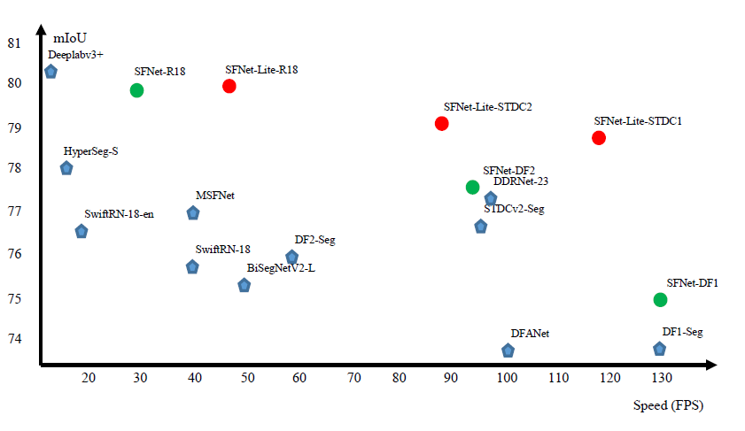
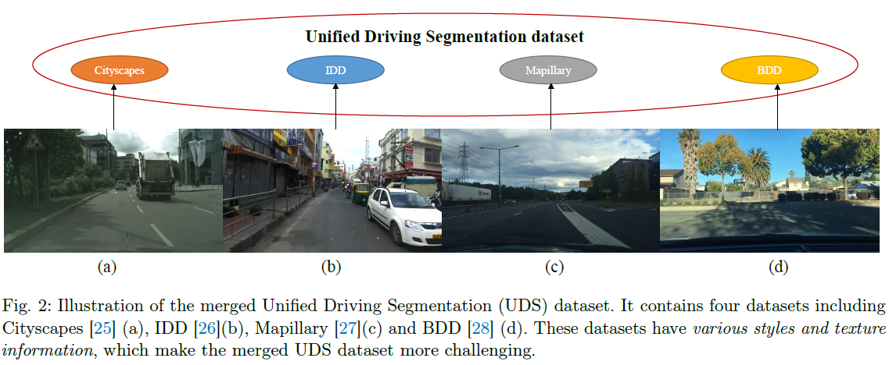

# SFSegNets(ECCV-2020-oral) and SFNet-Lite (Extension, IJCV-2023)
Reproduced Implementation of Our ECCV-2020 oral paper: Semantic Flow for Fast and Accurate Scene Parsing.

**News! SFNet-Lite is accepted by IJCV!! A good end to my last work in the PhD study!!!**

**Extension: SFNet-Lite achieve 78.8 mIoU while running 120 FPS, 80.1 mIoU while running at 50 FPS on TITAN-RTX.**



**Extension: SFNet-Lite achieve new state-of-the-art results (best speed and accuracy trade-off) on domain agnostic driving 
segmentation benchmark (Unified Driving Segmentation).**



**SFNet is the first real time nework which achieves the 80 mIoU on Cityscape test set!!!!**
It also contains our another concurrent work: SRNet-IEEE-TIP:[link](https://arxiv.org/abs/2011.03308).


Our methods achieve the best speed and accuracy trade-off on multiple scene parsing datasets.  


Note that the original paper link is on [TorchCV](https://github.com/donnyyou/torchcv) where you can train SFnet models. 
However, that repo is over-complex for further research and exploration.

## Question and Dissussion 

If you **have any question and or dissussion on fast segmentation**, just open an issue. I will reply asap if I have the spare time.

## DataSet Setting
Please see the DATASETs.md for the details.

## Requirements

pytorch >=1.4.0
apex
opencv-python
mmcv-cpu

## Pretrained models and Trained CKPTs
Please download the pretrained models and put them into the pretrained_models dir on the root of this repo.

### pretrained imagenet models

resnet101-deep-stem-pytorch:[link](https://drive.google.com/file/d/11s2vaTV71Lc160TMulrmodletcEgRYqi/view?usp=sharing)

resnet50-deep-stem-pytorch:[link](https://drive.google.com/file/d/1H2LhFcDZy6-4K5Yfs-8mHbTSe3WdaTrd/view?usp=sharing)

resnet18-deep-stem-pytorch:[link](https://drive.google.com/file/d/16mcWZSWbV3hkFWJ2cP_eJRQ6Nr1BncCp/view?usp=sharing)

dfnetv1:[link](https://drive.google.com/file/d/1xkkmIjKUbMifcrKdWU7I_-Jx_1YQAXfN/view?usp=sharing)

dfnetv2:[link](https://drive.google.com/file/d/1ZRRE99BPhbXwq-ZzO8A5GFmfCe7zxMsz/view?usp=sharing)

stdcv1/stdc2:[link](https://drive.google.com/drive/folders/1mgBLc7BGFPjM5wJXz0zjHiCn6jT9MWpT?usp=sharing)


### trained ckpts:


#### SFNet ckpts: 

##### Cityscape: 

sf-resnet18-Mapillary:[link](https://drive.google.com/file/d/1Hq7HhszrAicAr2PnbNN880ijAYcxJJ0I/view?usp=sharing)

Please download the trained model, the mIoU is on Cityscape validation dataset.

resnet18(no-balanced-sample): 78.4 mIoU 

resnet18: 79.0 mIoU [link](https://drive.google.com/file/d/1X7w1HYrSXOJBkfRJuxtXdmR0BXUR-hR8/view?usp=sharing)
+dsn [link](https://drive.google.com/file/d/1-U6NzJ0vb3q4Ev7YZ5FkL9X0L__bozM2/view?usp=sharing)

resnet18 + map: 79.9 mIoU [link](https://drive.google.com/file/d/1wiJC_skx8MaZD6B0waz0CWnQBUlcQ6UD/view?usp=sharing) 

resnet50: 80.4 mIoU [link](https://drive.google.com/file/d/1oAOPISp_Rqva_9whsF7eE3pFxuGSc1Wf/view?usp=sharing)

dfnetv1: 72.2 mIoU [link](https://drive.google.com/file/d/1aP9d4QVbGvBTABOFvi-okOs6DmJU8njH/view?usp=sharing)

dfnetv2: 75.8 mIoU [link](https://drive.google.com/file/d/1iGE9IYImdrs5p0i3k85OoCQzuSUNhjNU/view?usp=sharing)


#### SFNet-Lite ckpts:

##### Cityscape: 

sfnet_lite_r18: [link](https://drive.google.com/file/d/1ifpyw3qEAzpzzKL_mZANrXJ_WfcaIWre/view?usp=sharing)

sfnet_lite_r18_coarse_boost: [link](https://drive.google.com/file/d/1wqyHvIK5ccFfncU0rDg6g_p0NRJq4pkV/view?usp=sharing)

sfnet_lite_stdcv2: [link](https://drive.google.com/file/d/1Xx5IRL80yu2ak9gCWWl4aXV1OdwhCsDG/view?usp=sharing)

sfnet_lite_stdcv1: [link](https://drive.google.com/file/d/1DAZhnklnBKIbQZprCB1N1TwdZwU0OL6f/view?usp=sharing)


##### Unified Driving Segmentation dataset ckpts:

sfnet_lite_r18: [link](https://1drv.ms/u/s!Ai4mxaXd6lVBgQwhOL4whiHtNrye?e=4yW5aM)

sfnet_lite_stdcv1: [link](https://1drv.ms/u/s!Ai4mxaXd6lVBgQopAjfwiFSotuWW?e=h5NUgw)

sfnet_lite_stdcv2: [link](https://1drv.ms/u/s!Ai4mxaXd6lVBgQtmYXGHgyUnPUhn?e=GBHjq2)


#### IDD dataset

sfnet_lite_r18: [link](https://1drv.ms/u/s!Ai4mxaXd6lVBgQ6f8-aRMV-p9OGs?e=3NodMB)

sfnet_lite_stdcv1: [link](https://1drv.ms/u/s!Ai4mxaXd6lVBgQ2qAkSh9gI9ix8b?e=rXrmkB)

sfnet_lite_stdcv2: [link](https://1drv.ms/u/s!Ai4mxaXd6lVBgQ-Pchi1UaEtW_Rv?e=OAFU6Y)


#### BDD dataset 

sfnet_lite_r18: [link](https://1drv.ms/u/s!Ai4mxaXd6lVBgRLCAX25vKyQ-R4f?e=5BNIcR)

sfnet_r18: [link](https://1drv.ms/u/s!Ai4mxaXd6lVBgRFZnJjcIxNNS8jS?e=em7RTQ)


#### Mapillary dataset 

to be release. 


## Demo 

### Visualization Results

python demo_folder.py --arch choosed_architecture --snapshot ckpt_path --demo_floder images_folder --save_dir save_dir_to_disk

## Training 

All the models are trained with 8 GPUs.
The train settings require 8 GPU with at least **11GB** memory. 
Please download the pretrained models before training.


*Train ResNet18 model on Cityscapes*

SFNet r18

```bash
sh ./scripts/cityscapes/train_cityscapes_sfnet_res18.sh
```

SFNet-Lite r18

```bash
sh ./scripts/cityscapes/train_cityscapes_sfnet_res18_v2_lite_1000e.sh
```

Train ResNet101 models

```bash
sh ./scripts/cityscapes/train_cityscapes_sfnet_res101.sh
```

## Submission for test 

```bash
sh ./scripts/submit_test_cityscapes/submit_cityscapes_sfnet_res101.sh
```

## Train the Domain Agnostic SFNet for UDS dataset.

Please use the DATASETs.md to prepare the UDS dataset. 


```bash
sh ./scripts/uds/train_merged_sfnet_res18_v2.sh
```


## Citation
If you find this repo is useful for your research, Please consider citing our paper:


```
@article{Li2022SFNetFA,
  title={SFNet: Faster and Accurate Domain Agnostic Semantic Segmentation via Semantic Flow},
  author={Xiangtai Li and Jiangning Zhang and Yibo Yang and Guangliang Cheng and Kuiyuan Yang and Yu Tong and Dacheng Tao},
  journal={IJCV},
  year={2023},
}
@inproceedings{sfnet,
  title={Semantic Flow for Fast and Accurate Scene Parsing},
  author={Li, Xiangtai and You, Ansheng and Zhu, Zhen and Zhao, Houlong and Yang, Maoke and Yang, Kuiyuan and Tong, Yunhai},
  booktitle={ECCV},
  year={2020}
}

@article{Li2020SRNet,
  title={Towards Efficient Scene Understanding via Squeeze Reasoning},
  author={Xiangtai Li and Xia Li and Ansheng You and Li Zhang and Guang-Liang Cheng and Kuiyuan Yang and Y. Tong and Zhouchen Lin},
  journal={IEEE-TIP},
  year={2021},
}
```

## Acknowledgement 
This repo is based on Semantic Segmentation from [NVIDIA](https://github.com/NVIDIA/semantic-segmentation) and [DecoupleSegNets](https://github.com/lxtGH/DecoupleSegNets)

Great Thanks to **SenseTime Research** for Reproducing All these model ckpts and pretrained model.


## License
MIT
